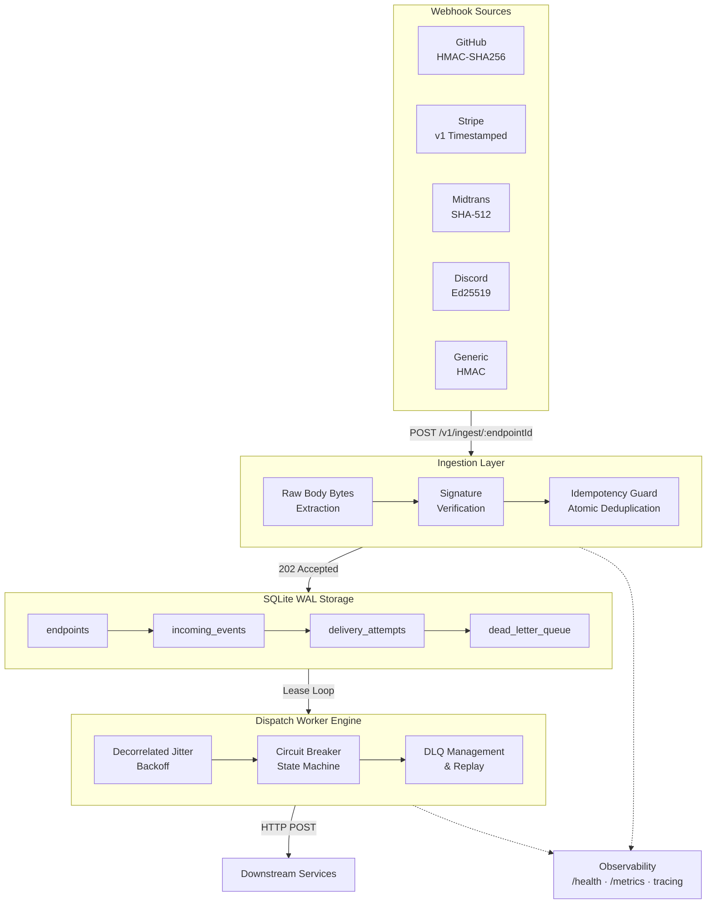

# AetherRelay

A lightweight webhook ingestion and dispatch gateway written in Rust, backed by embedded SQLite WAL storage.

[](LICENSE)
[](https://www.rust-lang.org/)
[](https://axum.rs/)
[](https://sqlite.org/wal.html)
[](https://github.com/Schnee111/aether-relay/releases)

---

## Overview

AetherRelay acts as a resilient buffer between external webhook providers (GitHub, Stripe, Midtrans, Discord) and downstream application services. 

Routing incoming webhooks directly to backend application endpoints introduces failure modes during downstream restarts, database locks, or unexpected traffic bursts. AetherRelay addresses this by:

1. Ingesting incoming payloads immediately with `HTTP 202 Accepted`.
2. Verifying provider cryptographic signatures in constant time.
3. Persisting events into an embedded SQLite database in WAL mode with atomic deduplication.
4. Delivering payloads to downstream endpoints via background workers with jittered backoff, circuit breaking, and dead-letter queues.

---

## Architecture



---

## Features

- **Zero-Copy Ingestion**: Raw body byte extraction preserves exact payloads for constant-time HMAC and Ed25519 cryptographic verification.
- **Provider Adapters**: Built-in verification for GitHub (HMAC-SHA256), Stripe (v1 timestamped with replay window check), Midtrans (SHA-512), Discord (Ed25519), and generic HMAC.
- **Atomic Deduplication**: Events are deduplicated on arrival by `(endpoint_id, idempotency_key)`. Replayed requests return the original event ID without creating duplicate deliveries.
- **Reliable Dispatch**: Downstream delivery runs as an asynchronous background loop using AWS decorrelated jitter exponential backoff.
- **Circuit Breaker**: Per-endpoint circuit breakers (Closed / Open / Half-Open) protect degraded downstream endpoints from cascading failure.
- **Dead-Letter Queue (DLQ)**: Failed events exceeding max retry attempts are isolated into a DLQ for forensic inspection and manual or automated replay.
- **Observability**: Structured JSON logging, `/health` endpoint, and optional Prometheus metrics exporter on `/metrics`.

---

## Benchmarks & Performance

Measured on a 2-vCPU Linux machine (release build with static musl linking and Prometheus metrics enabled):

| Metric / Scenario | Observed Result | Target |
| :--- | :--- | :--- |
| **Cold Start Latency** | 10.61 ms (p50 across 10 trials) | ≤ 50 ms |
| **Ingestion Throughput** | 2,147.0 req/s (concurrency 20) | High-load burst |
| **Latency (p99)** | 41.03 ms under load | Sub-100 ms |
| **Memory Footprint (RSS)** | 13.36 MB peak (60s continuous load) | ≤ 20 MB |
| **Crash Durability** | Zero event loss across `kill -9` restarts | 100% durability |
| **Static Binary Size** | 10.61 MB (`x86_64-unknown-linux-musl`) | Compact deployment |
| **Docker Image Size** | 9.70 MB (`scratch` runtime base) | ≤ 20 MB |

---

## Quickstart

### Build from Source

Requirements: Rust toolchain (stable, 2024 edition).

```bash
git clone https://github.com/Schnee111/aether-relay.git
cd aether-relay

# Run tests
cargo test

# Build release binary
cargo build --release

# Run locally
./target/release/aether-relay
```

### Docker Deployment

AetherRelay builds as a minimal static binary running in a `scratch` container image:

```bash
docker build -t aether-relay:latest .

# Create data directory with permissions for unprivileged user (uid 65534)
mkdir -p ./data && sudo chown -R 65534:65534 ./data

docker run -d \
  -p 3000:3000 \
  -v "$PWD/data:/app/data" \
  --name aether-relay \
  aether-relay:latest
```

### Configuration

Configuration can be supplied via `config/default.toml` or overridden using environment variables:

```bash
export RELAY__SERVER__HOST="0.0.0.0"
export RELAY__SERVER__PORT=3000
export RELAY__DATABASE__PATH="./data/aether-relay.db"
export RELAY__AUTH__API_KEYS="your-admin-api-key"
export RELAY__METRICS__ENABLED="true"
```

---

## API Reference

### 1. Register Endpoint
```bash
curl -X POST http://localhost:3000/v1/endpoints \
  -H "Content-Type: application/json" \
  -H "X-Api-Key: your-admin-api-key" \
  -d '{
    "name": "GitHub Production",
    "provider": "github",
    "secret": "your_webhook_secret",
    "target_url": "https://api.internal.net/webhooks/github"
  }'
```

Returns `201 Created` with the registered endpoint ID:
```json
{
  "id": "ep_01j9...",
  "name": "GitHub Production",
  "provider": "github",
  "target_url": "https://api.internal.net/webhooks/github"
}
```

### 2. Ingest Webhook
```bash
curl -X POST http://localhost:3000/v1/ingest/{endpoint_id} \
  -H "Content-Type: application/json" \
  -H "Idempotency-Key: evt_unique_12345" \
  -H "X-Hub-Signature-256: sha256=..." \
  -d '{"event":"push","ref":"refs/heads/main"}'
```

Returns `202 Accepted`:
```json
{
  "status": "accepted",
  "event_id": "01j9...",
  "idempotency_key": "evt_unique_12345"
}
```

### 3. Dead-Letter Queue (DLQ)
```bash
# List DLQ items
curl http://localhost:3000/v1/dlq \
  -H "X-Api-Key: your-admin-api-key"

# Replay a failed event back to pending queue
curl -X POST http://localhost:3000/v1/dlq/{dlq_id}/replay \
  -H "X-Api-Key: your-admin-api-key"
```

### 4. Health & Metrics
```bash
# Health check
curl http://localhost:3000/health

# Prometheus metrics (when metrics.enabled = true)
curl http://localhost:3000/metrics
```

---

## Development

```bash
# Run unit and integration tests
cargo test

# Format checking
cargo fmt --check

# Linter and static analysis
cargo clippy --all-targets -- -D warnings

# Security audit
cargo audit
```

---

## License

MIT License — see [LICENSE](LICENSE) for details.
