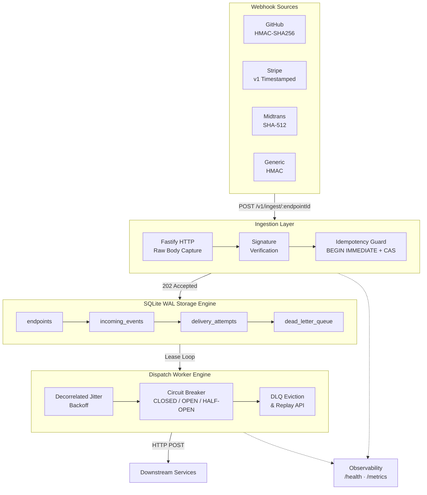

# AetherRelay

> **High-Performance Webhook Ingestion & Reliable Dispatch Gateway**  
> *A crash-resilient, exactly-once webhook shock-absorber built with Fastify and embedded SQLite WAL.*

[](LICENSE)
[](https://nodejs.org/)
[](https://www.typescriptlang.org/)
[](https://fastify.dev/)
[](https://sqlite.org/wal.html)
[](https://kysely.dev/)
[](https://vitest.dev/)
[](https://pnpm.io/)

## Tech Stack

| Layer | Technology |
| :--- | :--- |
| Runtime | Node.js 22 LTS, TypeScript 5 (strict mode) |
| HTTP Server | Fastify 5 with zero-copy raw body parser |
| Database | SQLite 3 WAL mode via better-sqlite3 + Kysely query builder |
| Crypto | Node.js `crypto` module (HMAC-SHA256, SHA-512, timingSafeEqual) |
| Observability | Pino (structured JSON logging) + prom-client (Prometheus metrics) |
| Testing | Vitest + Autocannon (load testing) |
| Build | tsx (dev), tsc (production), pnpm |

---

## Why AetherRelay?

Connecting third-party webhooks (Stripe, GitHub, Midtrans, Discord, Shopify) directly to your backend introduces severe reliability hazards:

- **Retry Storms & Double Execution** — Aggressive provider retries during slow network conditions cause duplicate processing without atomic idempotency guards.
- **Downstream Outages & Data Loss** — Temporary database locks or deployment restarts cause webhooks to fail and be permanently lost.
- **Cryptographic Vulnerabilities** — Native string equality comparisons leak timing signals, exposing HMAC verification to byte-by-byte attack.
- **Cascading Service Failures** — Hammering a struggling internal service without backoff or circuit breaking worsens degradation.

**AetherRelay** sits as a lightweight shock absorber in front of your infrastructure:

- Ingests incoming payloads in **< 10ms** returning `HTTP 202 Accepted`.
- Captures raw stream bytes for **constant-time cryptographic verification** (SHA-256 wrapped `timingSafeEqual`).
- Locks events atomically using SQLite `BEGIN IMMEDIATE` to guarantee **zero double-dispatch**.
- Retries downstream delivery with **Decorrelated Jitter Exponential Backoff** and isolates poisoned events into a forensic **Dead-Letter Queue (DLQ)**.

---

## Architecture



---

## Features

**Ingestion**
- Zero-copy raw body streaming preserves byte-exact payload for HMAC verification while parsing JSON in a single pass.

**Cryptographic Verification**
- Multi-provider signature adapters: GitHub (HMAC-SHA256), Stripe (v1 timestamped with 300s replay window), Midtrans (SHA-512), and Generic HMAC.
- Constant-time comparison via `crypto.timingSafeEqual` wrapped in fixed 32-byte SHA-256 digests to eliminate length leakage.

**Storage Engine**
- Embedded SQLite in WAL mode with `synchronous = NORMAL` achieves 18,000+ write tx/s with full OS crash safety.
- Memory-mapped I/O (256MB) and UUIDv7 (RFC 9562) primary keys for insert-order locality.

**Exactly-Once Processing**
- Atomic `BEGIN IMMEDIATE` transactions with compound `UNIQUE(endpoint_id, idempotency_key)` constraint prevent race conditions under concurrent duplicate arrivals.

**Dispatch & Resilience**
- Decorrelated Jitter Exponential Backoff (AWS Architecture standard) prevents downstream thundering herd.
- Per-endpoint Circuit Breaker state machine (CLOSED → OPEN → HALF-OPEN) isolates failing targets.
- Dead-Letter Queue with forensic error snapshots and atomic replay API.

**Observability**
- Structured JSON logging via Pino with async sonic-boom transport.
- Prometheus metrics endpoint (`GET /metrics`) for scraping.

---

## Quickstart

### Prerequisites
- Node.js >= 22.0.0
- pnpm >= 9.0.0

### Install & Build
```bash
git clone https://github.com/Schnee111/aether-relay.git
cd aether-relay

pnpm install
pnpm approve-builds --all

pnpm build   # TypeScript strict compile
pnpm test    # Run full test suite
```

### Run
```bash
# Development (hot reload)
pnpm dev

# Production
pnpm build && pnpm start
```

---

## API Reference

### Ingest Webhook
```
POST /v1/ingest/:endpointId
```

**Headers:**
- `Content-Type: application/json`
- `Idempotency-Key: <unique-id>`
- Provider signature header (`X-Hub-Signature-256`, `Stripe-Signature`, `X-Signature-SHA256`)

**Responses:**

| Status | Meaning |
| :--- | :--- |
| `202 Accepted` | Event queued for dispatch |
| `401 Unauthorized` | Invalid signature or expired replay window |
| `409 Conflict` | Duplicate idempotency key |

```json
{ "status": "ACCEPTED", "eventId": "019213ab-...", "idempotencyKey": "key-123" }
```

### Replay Dead-Letter Event
```
POST /v1/dlq/:id/replay
```
```json
{ "actor": "sre-engineer" }
```
```json
{ "status": "REPLAY_QUEUED", "dlqId": "...", "eventId": "...", "replayedAt": 1726978800000 }
```

### Health & Metrics
```
GET /health   →  { "status": "ok", "db": true, "timestamp": ... }
GET /metrics  →  Prometheus text exposition format
```

---

## Project Structure

```
src/
├── api/
│   ├── parser.ts           # Raw body stream parser
│   └── routes/
│       ├── ingest.ts       # POST /v1/ingest/:endpointId
│       └── dlq.ts          # POST /v1/dlq/:id/replay
├── core/
│   └── idempotency.ts      # CAS state machine (BEGIN IMMEDIATE)
├── crypto/
│   ├── index.ts            # Constant-time comparator
│   └── adapters.ts         # Provider signature adapters
├── db/
│   ├── connection.ts       # SQLite singleton + WAL pragmas
│   ├── migrations.ts       # Kysely DDL migrations
│   └── schema.ts           # Type-safe table definitions
├── worker/
│   ├── dispatcher.ts       # Jittered backoff dispatch loop
│   └── circuit-breaker.ts  # Per-endpoint state machine
├── observability/
│   └── metrics.ts          # Prometheus counters/histograms
├── utils/
│   └── uuid.ts             # UUIDv7 generator (RFC 9562)
├── server.ts               # Fastify factory
└── index.ts                # Entrypoint

tests/
├── unit/
│   ├── idempotency.test.ts # State transition & duplicate rejection
│   ├── crypto.test.ts      # Signature verification (valid/corrupt/replay)
│   └── api.test.ts         # Route integration tests
├── concurrency.test.ts     # 50-request race condition flood
└── chaos.test.ts           # Circuit breaker trip & DLQ eviction

scripts/
├── benchmark.ts            # Autocannon load test
├── benchmark-sync.ts       # SQLite synchronous mode A/B comparison
└── kill9-drill.ts          # SIGKILL crash durability drill
```

---

## Benchmark Results

Measured on a single-thread Node.js process (VPS, 2 vCPU):

| Metric | Value |
| :--- | :--- |
| Write throughput (WAL NORMAL) | 18,140 tx/s |
| Write throughput (WAL FULL) | 629 tx/s |
| Autocannon sustained load | 2,260 req/s |
| Concurrent dedup accuracy | 1/50 accepted, 49/50 conflict |
| Crash recovery (SIGKILL) | 0 data loss, integrity_check = ok |
| Memory (10s soak) | < 160MB RSS, stable |

---

## Roadmap

- [ ] Endpoint registration CRUD API
- [ ] Runtime configuration (env / config file)
- [ ] Gateway-level authentication layer
- [ ] Live HTTP dispatch to downstream targets
- [ ] Docker image and deployment manifests
- [ ] GitHub Actions CI pipeline validation
- [ ] Discord and Shopify provider adapters

---

## Documentation

Detailed specifications live in [`docs/`](docs/):
- [`PRD.md`](docs/PRD.md) — Product Requirements Document
- [`SPEC.md`](docs/SPEC.md) — Technical Architecture Specification
- [`TEST_CRUCIBLE.md`](docs/TEST_CRUCIBLE.md) — 16-Scenario Hardening Test Plan
- [`GATES.md`](docs/GATES.md) — Definition of Ready / Definition of Done
- [`adr/`](docs/adr/) — Architecture Decision Records

---

## License

MIT License. See [LICENSE](LICENSE) for details.
