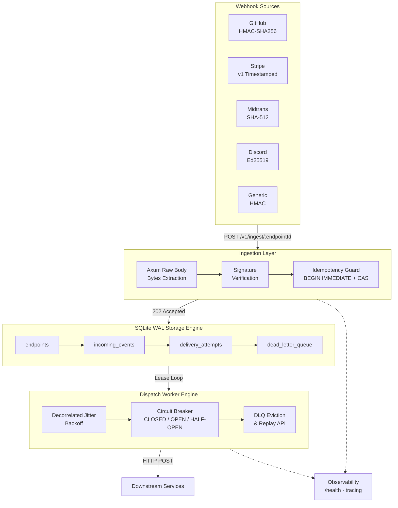

# AetherRelay

> **High-Performance Webhook Ingestion & Reliable Dispatch Gateway**  
> *A crash-resilient, exactly-once webhook shock-absorber built with Axum and embedded SQLite WAL.*

[](LICENSE)
[](https://www.rust-lang.org/)
[](https://axum.rs/)
[](https://sqlite.org/wal.html)
[](https://docs.rs/rusqlite/)
[](https://tokio.rs/)
[](https://github.com/Schnee111/aether-relay/actions)
[](https://rustsec.org/advisories/)
[](https://github.com/Schnee111/aether-relay/releases)

## Tech Stack

| Layer | Technology |
| :--- | :--- |
| Language | Rust 2024 edition (stable) |
| Async Runtime | tokio 1.x (multi-thread, full features) |
| HTTP Server | Axum 0.8 + Tower middleware |
| Database | SQLite 3 WAL mode via rusqlite + r2d2 pool |
| Crypto | hmac + sha2 (RustCrypto) + ed25519-dalek (constant-time) |
| Observability | tracing + tracing-subscriber (JSON/pretty) |
| Testing | cargo test + tower-http for integration |
| Build | cargo + musl static linking |

---

## Why AetherRelay?

Connecting third-party webhooks (Stripe, GitHub, Midtrans, Discord, Shopify) directly to your backend introduces severe reliability hazards:

- **Retry Storms & Double Execution** — Aggressive provider retries during slow network conditions cause duplicate processing without atomic idempotency guards.
- **Downstream Outages & Data Loss** — Temporary database locks or deployment restarts cause webhooks to fail and be permanently lost.
- **Cryptographic Vulnerabilities** — Native string equality comparisons leak timing signals, exposing HMAC verification to byte-by-byte attack.
- **Cascading Service Failures** — Hammering a struggling internal service without backoff or circuit breaking worsens degradation.

**AetherRelay** sits as a lightweight shock absorber in front of your infrastructure:

- Ingests incoming payloads in **< 10ms** returning `HTTP 202 Accepted`.
- Captures raw stream bytes for **constant-time cryptographic verification** (HMAC-SHA256, SHA-512, Ed25519).
- Locks events atomically using SQLite `BEGIN IMMEDIATE` to guarantee **zero double-dispatch**.
- Retries downstream delivery with **Decorrelated Jitter Exponential Backoff** and isolates poisoned events into a forensic **Dead-Letter Queue (DLQ)**.

---

## Architecture



---

## Features

**Ingestion**
- Zero-copy raw body extraction via `axum::body::Bytes` preserves byte-exact payload for HMAC verification while parsing JSON in a single pass.

**Cryptographic Verification**
- Multi-provider signature adapters: GitHub (HMAC-SHA256), Stripe (v1 timestamped with 300s replay window), Midtrans (SHA-512), Discord (Ed25519), and Generic HMAC.
- Constant-time comparison via `hmac::Mac::verify_slice()` and `ed25519_dalek::verify_strict()` prevents timing attacks.

**Atomic Persistence**
- Embedded SQLite WAL mode with `PRAGMA synchronous = NORMAL`, `busy_timeout = 5000ms`, memory-mapped I/O (256 MB).
- Compare-And-Swap idempotency engine using `BEGIN IMMEDIATE` transactions guarantees exactly-once delivery.

**Resilient Dispatch**
- AWS-style decorrelated jitter backoff (`sleep = min(cap, random(base..prev*3))`) for retry scheduling.
- Per-endpoint circuit breaker state machine (CLOSED → OPEN → HALF-OPEN) with configurable thresholds.
- Forensic dead-letter queue with replay capability for poisoned event recovery.

**Observability**
- Structured JSON logging via `tracing-subscriber` with span-based request tracking.
- Health endpoint (`GET /health`) returning status, version, and uptime.

> **Note:** A Prometheus `/metrics` endpoint is *planned but not implemented* in v0.2.0. Do not scrape it.

---

## Performance Targets

| Metric | Target |
| :--- | :--- |
| Ingestion throughput | ≥ 10,000 req/s sustained |
| Ingestion p99 latency | ≤ 5 ms |
| SQLite write throughput | ≥ 25,000 tx/s |
| Memory (RSS) under load | ≤ 20 MB |
| Cold start to listening | ≤ 50 ms |
| Binary size (musl) | ≤ 10 MB |
| Docker image size | ≤ 20 MB |

---

## Quickstart

### Prerequisites
- Rust toolchain (stable, 2024 edition): `curl --proto '=https' --tlsv1.2 -sSf https://sh.rustup.rs | sh`
- Docker (for containerized deployment): any modern version supporting scratch images

### Build from Source
```bash
git clone https://github.com/Schnee111/aether-relay.git
cd aether-relay

# Run tests
cargo test

# Build release binary
cargo build --release --target x86_64-unknown-linux-musl

# Run locally
./target/x86_64-unknown-linux-musl/release/aether-relay
```

### Docker Deployment
```bash
docker build -t aether-relay:latest .
docker run -p 3000:3000 -v ./data:/app/data aether-relay:latest
```

### Configuration
Environment variable overrides take precedence over `config/default.toml`:
```bash
export RELAY__SERVER__HOST="0.0.0.0"
export RELAY__SERVER__PORT=3000
export RELAY__DATABASE__PATH="./aether-relay.db"
export RELAY__AUTH__API_KEYS="your-secret-key-here"
```

---

## API Reference

### Register Endpoint
```bash
curl -X POST http://localhost:3000/v1/endpoints \
  -H "Content-Type: application/json" \
  -H "X-Api-Key: your-secret" \
  -d '{
    "name": "GitHub Production",
    "provider": "github",
    "secret": "gh_webhook_secret",
    "target_url": "https://internal.example.com/hook"
  }'
```

### Ingest Webhook
```bash
curl -X POST http://localhost:3000/v1/ingest/{endpoint_id} \
  -H "Content-Type: application/json" \
  -H "Idempotency-Key: unique-request-id" \
  -H "X-Hub-Signature-256: sha256=<signature>" \
  -d '{"event":"push","ref":"refs/heads/main"}'
```

### View Dead-Letter Queue
```bash
curl http://localhost:3000/v1/dlq
```

### Replay Failed Event
```bash
curl -X POST http://localhost:3000/v1/dlq/{dlq_id}/replay \
  -H "X-Api-Key: your-secret"
```

---

## Quality Gates

This project enforces strict engineering standards:
- **Clippy**: `cargo clippy -- -D warnings` must pass with zero warnings.
- **Format**: `cargo fmt --check` enforced in CI.
- **Testing**: All unit and integration tests must pass.
- **Security**: `cargo audit` scans dependencies for known vulnerabilities.
- **Reviews**: PRs reviewed via Shorekeeper Sentinel before merge.

---

## Contributing

See [SPEC.md](docs/rust/SPEC.md) for technical architecture details and [TEST_CRUCIBLE.md](docs/rust/TEST_CRUCIBLE.md) for the 20 mandatory verification scenarios.

All contributions follow the [Development Workflow](.hermes/SKILL.md) pipeline: DEFINE → PLAN → BUILD → VERIFY → POLISH → REVIEW → SHIP.

---

## License

MIT License — see LICENSE file for details.

---

Built by Schnee & Shorekeeper 🚀
